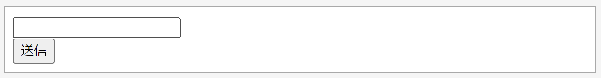
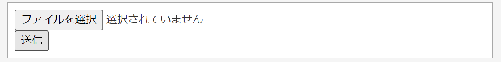
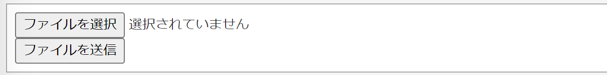

[](ファイル名はコマンド名.md)
# < form > < /form >

入力・送信フォームを作成する際に使用するタグ。フォームのデータをどこに送信するのか、どのように送信するのかを指定する。


  記述例 [](変更しない)
  
  ```
  <FORM METHOD=POST ACTION="URLを指定">
    <INPUT TYPE=text NAME=変数名> 
    <INPUT TYPE=submit> 
  </FORM>
  ```
  ＊記述例では大文字で書いているが小文字でも良い。

  ### 使用できるタグ一覧

- **inputタグ** 
    
  フォームのパーツを作成するためのタグ。type属性を設定することで、テキストを入力するのか、データを送信するのかなどを指定できる。
  
  | 要素| 内容 |
  | :---: | :---: |
  |type="text"|テキスト入力欄を作成|
  |type="file"|ファイル選択を作成|
  |type="submit"|送信ボタンを作成|
  


  記述例.1　[](変更しない)
  
  ```
  <FORM METHOD=POST ACTION="URLを指定">
    <INPUT TYPE=text >
    <br>  <!-- <br>は改行 -->
    <INPUT TYPE=submit>
  </FORM>
  ```
  この例では、ACTIONで指定したURLにINPUTのtextの値を送信している。
  <br>


  実行結果.1　[](変更しない)
  
  <br>
 

  記述例.2　[](変更しない)
  
  
  ```
  <FORM METHOD=POST ACTION="URLを指定">
    <INPUT TYPE=file >
    <br>
    <INPUT TYPE=submit>
  </FORM>
  ```
  この例では、ACTIONで指定したURLにINPUTのfileの値を送信している。
  <br>


  実行結果.2　[](変更しない)
  
  <br>

### 属性一覧


- **action属性**
  
  formタグ内で指定する属性。データを送信する先(URL)を指定する。

  記述例 [](変更しない)
  
  ```
  <FORM ACTION="URLを指定">
  ```

- **method属性** 
  
  formタグ内で指定する属性。
  フォームのデータをどのように送信するか指定する。
  指定できる要素にpostとgetがある。
  | 要素| 内容 |
  | :---: | :---: |
  |post|フォームで入力されたデータをサーバに送信する|
  |get |何か情報を検索したり取得するときに使う|
  
  記述例　[](変更しない)
  
  ```
  <FORM METHOD="POST" ACTION="URLを指定">
  ```


  


- **name属性** 
    
  inputタグ内で指定する属性。フォームの見た目には影響しないが、データがどの記入欄に対応しているのかをサーバ側で把握できるようになる。
  
  実行例　[](変更しない)
  
  ```
  <FORM METHOD=POST ACTION="URLを指定">
    <INPUT TYPE=text name=username> 
    <br>
    <INPUT TYPE=submit > 
  </FORM>
  ```


  実行結果　[](変更しない)
  
  <br>

- **value属性** 
  
  inputタグ内で指定する属性。value="文字列"のように指定すると、記入欄の場合は初期値を設定、ボタンの場合はボタンに文字を記入できる。
  
  
  実行例　[](変更しない)
  
  ```
  <FORM METHOD=POST ACTION="URLを指定">
    <INPUT TYPE=file NAME=file> 
    <br>
    <INPUT TYPE=submit value=ファイルを送信> 
  </FORM>
  ```


  実行結果　[](変更しない)
  


