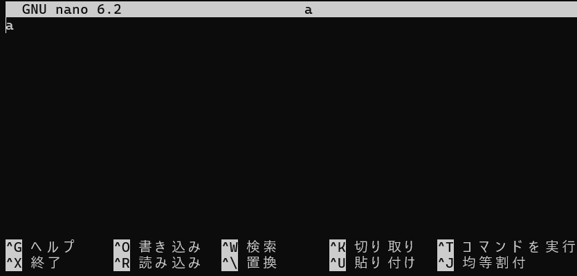
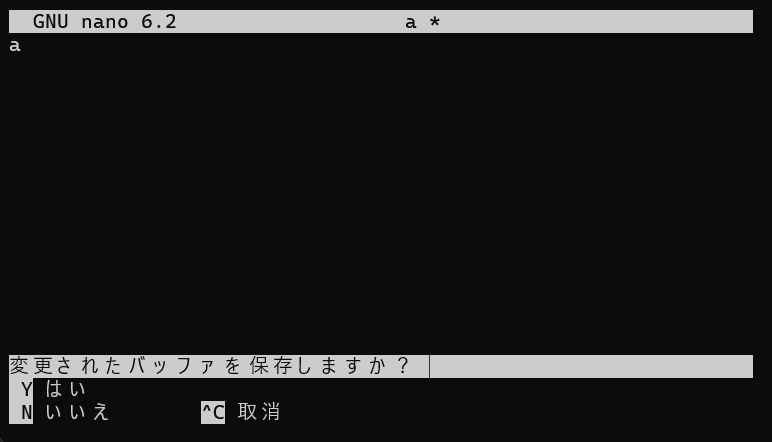
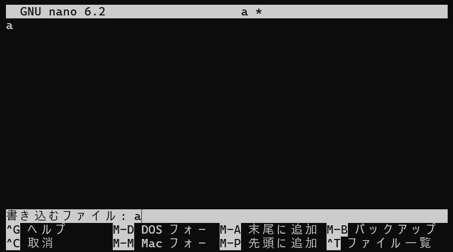

[](ファイル名はコマンド名.md)
## nano
Nanoはテキストエディタであり、viと異なりモード変更は使用せず、ctrl+αで操作を行う。

実行例

  ```
  nano ファイル名
  ```
  実行結果　[](変更しない)


  ```
  ファイル名を指定して起動する
  そのファイルが実行したディレクトリになければ作成する
  この時、エディタ画面になり、文字を入力できるようになる
  ```

**基本操作一覧**
  

 - **ctrl+x**
  
   ### おかしくなったと思ったらまずこれ！

   nanoのエディタ画面から抜けたいときに使用する

   保存するかどうか聞かれるので

   するときはyを、しないときはnを押す

   yを押した場合、保存するファイルの名前を聞かれるので、Enterを押すと元の画面に戻る

   nを押した場合、保存せずに元の画面に戻る


   実行例 [](変更しない)
  
   ```
   ctrl+x
   nまたはy
   yを押した場合、Enter
   ```


   実行結果　[](変更しない)

   エディタ画面

   

   ctrl+xを押した画面
   
   
   
   yを選んだ画面
   
   

   Enterを押す

   ```
   nの場合、ファイルが生成されない、または編集されない
   yの場合、ファイルを生成、または編集された状態で保存
   ```


- **右クリック**
  
  コピーとペーストを行う際に使う

   #### 使えたら便利な操作

- **ctrl+o** 
    
  一時保存
  
  実行例　[](変更しない)
  
  ```
  ctrl+o
  Enter
  ```


  実行結果　[](変更しない)


  ```
  エディタ画面のまま保存する
  ```
- **ctrl+k** 
    
  その行の削除
  
  実行例　[](変更しない)
  
  ```
  ctrl+k
  ```


  実行結果　[](変更しない)


  ```
  カーソルのある行をすべて削除(ctrl+uで最後に消した行のみ復元)
  ```

